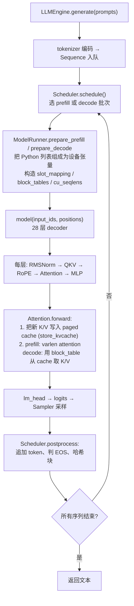

# nano-vllm CPU 适配与调试指南

> **读者**：第一次接触 nano-vllm / 推理引擎适配的工程师。
> **目标**：拿到上游原始仓库（无任何补丁）后，能够有方法、有节奏地在 CPU 上完成适配，并通过数值验证确认"跑对"而不仅是"跑通"。
> **参考实现**：本文档描述的全部改动对应 commit `653c4be`（nanovllm: add CPU backend with SDPA attention），可对照阅读。
> **约定**：文中"上游"指 GeeeekExplorer/nano-vllm 原始代码；所有报错摘录均为真实踩坑记录。

---

## 1. 适配前必须建立的全局认知

### 1.1 这个项目是什么

nano-vllm 是一个约 1400 行的迷你 vLLM：用 PyTorch 实现了 LLM 推理引擎的核心机制
（continuous batching、PagedAttention、prefix caching、chunked prefill），只支持
Qwen3。它**从头到尾假设 CUDA 存在**，这正是适配工作的全部来源。

### 1.2 模块地图与耦合点

| 模块 | 职责 | 与 GPU 的耦合 |
|---|---|---|
| `nanovllm/config.py` | 全局配置 | 无显式耦合（隐含 GPU 显存语义） |
| `nanovllm/engine/scheduler.py` | 调度：prefill/decode 组批、抢占 | 无（纯 Python，天然跨设备） |
| `nanovllm/engine/block_manager.py` | KV cache 块管理、prefix cache 哈希 | 无（纯 Python + xxhash） |
| `nanovllm/engine/model_runner.py` | 组张量、跑模型、显存管理、CUDA Graph、分布式 | **重度耦合** |
| `nanovllm/layers/attention.py` | 注意力 + KV cache 读写 | **重度耦合**（triton + flash-attn） |
| `nanovllm/layers/layernorm.py` `rotary_embedding.py` `activation.py` | 算子 | 轻度（`@torch.compile`） |
| `nanovllm/layers/linear.py` `embed_head.py` | 并行线性层 | 轻度（构造期调用 `dist.get_rank`） |
| `nanovllm/models/qwen3.py` | 模型结构 | 轻度（`dist.get_world_size`） |

> **方法论第一条**：适配工作开始前，先做这张表。用
> `grep -rn "cuda\|flash_attn\|triton\|dist\.\|nccl" nanovllm/`
> 把所有设备相关调用点列出来，归类为"必须替换 / 需要守卫 / 天然无碍"三档。
> 没有这张清单，适配就会变成打地鼠。

### 1.3 一次 generate 的完整数据流



### 1.4 三个必须彻底理解的数据结构

适配 90% 的认知成本在这三个结构上，建议花半天时间在 `sequence.py` /
`block_manager.py` / `context.py` 上逐行读完：

1. **slot_mapping**（prefill/decode 都有）：
   每个新 token 在 KV cache 里的**全局槽位** = `block_id * block_size + 块内偏移`。
   KV cache 物理形状 `(num_blocks, block_size, num_kv_heads, head_dim)`，
   槽位即"平坦化后的一维下标"。triton kernel 和你的 torch 替代实现必须写进同一个位置。

2. **block_tables**（decode、带 prefix 的 prefill）：
   每条序列 → 它占用的一串 block_id，尾部用 `-1` padding。
   从 cache 读序列的历史 K/V 就是：按 block_table 逐块取出再拼接。

3. **cu_seqlens_q / cu_seqlens_k**（prefill）：
   把一个 batch 内**长度不齐**的序列打包成一维张量（varlen），`cu_seqlens[i]`
   是第 i 条序列在该维张量上的起止偏移。`cu_seqlens_k > cu_seqlens_q`
   当且仅当该序列有 prefix cache 命中。

---

## 2. 适配目标与验收标准

**先把"完成"定义清楚，再动手。** 建议分三级：

| 级别 | 标准 | 验证方式 |
|---|---|---|
| L1 跑通 | 端到端生成文本，无异常退出 | `example.py` 类脚本 |
| L2 跑对 | 与参考实现（transformers 同精度）**逐 token 一致** | greedy 对比脚本（见 §6.2） |
| L3 可用 | 性能达标、边界输入稳定、内存可控 | 基线测量 + 边界用例矩阵 |

新手最常见的失败是把 L1 当成完成。**没有 L2 的适配不算完成**——
本指南第 8 节的乱码 bug 就是 L1 通过、L2 才暴露的。

---

## 3. 适配路线图（八个阶段）

每个阶段有明确的 DoD（完成定义），不要跳步：

```
Phase 0  通读代码，画出 §1.3 的数据流图          DoD: 能口头讲清 slot_mapping 生命周期
Phase 1  耦合点盘点（grep + 归类三档）            DoD: §1.1 风格的耦合点清单
Phase 2  目标设备能力探测                         DoD: probe 脚本全绿（§6.3）
Phase 3  依赖解耦（条件导入、可选依赖）           DoD: 无 flash-attn 环境下 import 不炸
Phase 4  算子逐个替换 + 单元级验证                DoD: 每个算子有独立 logits 对比
Phase 5  引擎层设备解耦                           DoD: 小参数端到端出文本（L1）
Phase 6  数值对齐验证                             DoD: greedy 逐 token 一致（L2）
Phase 7  边界与性能                               DoD: 边界矩阵通过 + 基线数据记录（L3）
```

**节奏建议**：Phase 4 每替换一个算子就立刻做一次单元验证（喂定长随机输入，
对比替换前后/参考实现的输出），不要把所有替换攒到最后一起验——
攒到最后你将面对"五个 bug 叠加、每个都疑似"的调试地狱。

---

## 4. 各模块实现细节

### 4.1 config.py：device 字段

```python
device: str = "cpu"

def __post_init__(self):
    ...
    assert self.device in ("cpu", "cuda", "mps")
    if self.device == "cuda":
        assert torch.cuda.is_available()
    ...
```

要点：
- 用 `assert` 快速失败，配置错误在启动瞬间暴露，而不是跑到一半。
- 默认值的选择体现产品意图（本项目默认 `cpu`，即"无 GPU 也能跑"）。

### 4.2 attention.py：三个核心替换

**替换一：KV cache 写入（triton → torch 索引）**

triton kernel 的语义：对每个 token，取 `slot = slot_mapping[i]`（`-1` 表示跳过），
把该 token 的 K/V 写入 cache 平坦视图的第 slot 行：

```python
def store_kvcache_torch(key, value, k_cache, v_cache, slot_mapping):
    mask = slot_mapping != -1
    slots = slot_mapping[mask]
    N, num_heads, head_dim = key.shape
    k_flat = k_cache.view(-1, num_heads, head_dim)   # (num_blocks*block_size, H, D)
    v_flat = v_cache.view(-1, num_heads, head_dim)
    k_flat[slots] = key[mask]
    v_flat[slots] = value[mask]
```

> 写替代 kernel 前，先逐行读懂原 kernel 的每一个参数（本例中 D 是 `H*head_dim`、
> 偏移按行计算），再把语义翻译成 torch。**不要凭感觉写。**

**替换二：从 paged cache 读取（flash-attn 内建 → 手动 gather）**

```python
def gather_kvcache_torch(cache, block_table_row, seqlen):
    num_heads, head_dim = cache.shape[-2:]
    block_size = cache.shape[1]
    nblocks = (seqlen + block_size - 1) // block_size
    return cache[block_table_row[:nblocks].long()].reshape(-1, num_heads, head_dim)[:seqlen]
```

**替换三：flash-attn → SDPA**

prefill 按序列循环（varlen 的等价展开），decode 逐序列取 cache：

```python
def forward_torch(self, q, k, v, context, k_cache, v_cache):
    o = torch.empty_like(q)
    if context.is_prefill:
        cu_q = context.cu_seqlens_q.tolist()
        cu_k = context.cu_seqlens_k.tolist()
        for i in range(len(cu_q) - 1):
            start, end = cu_q[i], cu_q[i + 1]
            seqlen_k = cu_k[i + 1] - cu_k[i]
            if context.block_tables is not None:       # prefix cache：K/V 已在 cache
                k_i = gather_kvcache_torch(k_cache, context.block_tables[i], seqlen_k)
                v_i = gather_kvcache_torch(v_cache, context.block_tables[i], seqlen_k)
            else:                                       # 首次 prefill：直接切当前 k/v
                k_i = k[cu_k[i]:cu_k[i + 1]]
                v_i = v[cu_k[i]:cu_k[i + 1]]
            o[start:end] = sdpa_torch(q[start:end], k_i, v_i, self.scale, end - start, seqlen_k)
    else:    # decode
        ...
```

**GQA**：Qwen3 是 16 个 Q 头、8 个 KV 头。SDPA 用 `enable_gqa=True`，
不要手动 `repeat_interleave`（多一次显存拷贝且容易把头维搞错）。

**chunked prefill 的因果掩码（易错点）**：当一条长序列被分块 prefill 时，
`sq < sk`（q 是本块的 token，k 包含历史前缀）。此时 flash-attn 的默认"右对齐"
因果语义必须手动还原：

```python
if sq == sk:
    attn_mask, is_causal = None, True                 # 常规因果
elif sq == 1:
    attn_mask, is_causal = None, False                # decode 单 token
else:    # chunked prefill：第 i 个 query 允许看到前 (sk - sq) 个前缀 token + 自身
    attn_mask = torch.ones(sq, sk, dtype=torch.bool, device=q.device).tril(diagonal=sk - sq)
    is_causal = False
```

> `is_causal=True` 在 PyTorch 里是**左上对齐**的因果掩码，只在 `sq == sk` 时
> 等价于 flash-attn 的语义。`sq != sk` 时直接用会静默算错——掩码错位类 bug
> 不报错、只产生微妙劣化的输出，是最难查的一类。

### 4.3 model_runner.py：引擎层解耦

| 原逻辑 | CPU 处理 | 理由 |
|---|---|---|
| `dist.init_process_group("nccl", ...)` | 非 cuda 用 `"gloo"` | nccl 仅支持 CUDA 张量 |
| `torch.cuda.set_device(rank)` | 仅 cuda 执行 | 守卫模式：`if self.device == "cuda"` |
| `torch.set_default_dtype(hf_config.dtype)` | CPU 用 **float32** | bf16 矩阵乘在多数 CPU 上慢且数值不稳 |
| `pin_memory=True + .cuda(non_blocking)` | 收敛为 `to_device()` 辅助方法 | cuda 行为保持不变，cpu 返回普通张量 |
| CUDA Graph | CPU 强制 eager | torch 无 CPU 等价物 |
| `@torch.compile` 系列 | `torch._dynamo.config.disable = True` | 一行全局禁用，避免 Inductor 编译等待 |
| KV cache 容量 = 显存探测 | 解析式计算（见下） | CPU 无"显存"概念 |

KV cache 容量的 CPU 逻辑——**按最坏情况精确分配，再设内存上限**：

```python
blocks_needed = config.max_num_seqs * ceil(max_model_len / block_size) + 1
page_size = os.sysconf("SC_PAGE_SIZE")
try:
    total_pages = os.sysconf("SC_AVPHYS_PAGES")     # linux：可用内存
except ValueError:                                   # macOS：只有总量
    total_pages = os.sysconf("SC_PHYS_PAGES")
max_blocks = page_size * total_pages * 25 // 100 // block_bytes
config.num_kvcache_blocks = min(blocks_needed, max_blocks)
```

> 为什么 GPU 版不能照搬？GPU 上 warmup 跑一次最大 batch 的前向，用
> `torch.cuda.memory_stats()` 的峰值来估算"还剩多少显存给 KV cache"。
> CPU 上没有这个观测手段，就换用解析式：`max_num_seqs` 条序列同时拉满
> `max_model_len` 是块用量的上界。**分配策略跟着观测能力走，而不是照抄。**

warmup 同理：GPU 大 warmup 是为了测显存峰值；CPU 只需要打通代码路径，
用 `1 条 × 16 token` 的迷你 warmup，否则启动时要白跑几千 token 的前向。

### 4.4 依赖与打包

`pyproject.toml` 把 `flash-attn`、`triton` 移入 `[project.optional-dependencies] cuda`；
代码里条件导入：

```python
try:
    import triton
    import triton.language as tl
    from flash_attn import flash_attn_varlen_func, flash_attn_with_kvcache
    HAS_FLASH_ATTN = True
except ImportError:
    HAS_FLASH_ATTN = False
```

GPU 代码路径包在 `if HAS_FLASH_ATTN:` 内。**要求：CPU-only 环境下
`import nanovllm` 不报错**——这是 Phase 3 的 DoD。

---

## 5. 环境准备

```bash
# conda base（本机验证环境）
python 3.13 / torch 2.13 / transformers 5.8 / safetensors / xxhash / tqdm / numpy
# 模型（ModelScope 缓存，含权重+tokenizer）
~/.cache/modelscope/hub/models/Qwen/Qwen3-0.6B
```

运行方式：`PYTHONPATH=<repo> python3 example_cpu.py`，无需 pip 安装。

---

## 6. 关键调试手段

### 6.1 分层二分定位法

输出乱码/胡言乱语时，**不要改代码碰运气**，按层收敛：

```
文本不对
  └─ 第 1 步：对齐参考实现，确认"参考侧"输出正常（先怀疑测试脚本！）
       └─ 第 2 步：只跑一次 prefill，对比最后一个 token 的 logits
            ├─ logits 就错 → 模型前向有 bug（attention/rope/norm/权重加载）
            │    └─ 第 3 步：逐层 register_forward_hook 对比中间激活，二分到第一层出错的层
            └─ logits 对，生成的文本错 → 采样/decode 路径问题
                 └─ 对比每一步 decode 的 logits（见 6.2 的 chain 捕获）
```

logits 级对比指标：`max|Δlogits|`、argmax 是否一致、top-5 重合度。
fp32 下 max|Δlogits| 应在 1e-3 量级以内；明显超出（如 >0.5）说明有逻辑错误而非数值噪声。

### 6.2 黄金参考：greedy 逐 token 对比脚本

这是整个适配过程中**最有价值的一个工具**，原理：把采样器替换成 argmax，
使两边都变成确定性 greedy，然后逐 token 对比：

```python
import os, torch
from nanovllm import LLM, SamplingParams
from nanovllm.layers.sampler import Sampler
from transformers import AutoTokenizer, AutoModelForCausalLM

path = os.path.expanduser("~/.cache/modelscope/hub/models/Qwen/Qwen3-0.6B")

# 1) 把 nano-vllm 的采样替换为 argmax（确定性）
Sampler.forward = lambda self, logits, temperatures: logits.argmax(dim=-1)

prompts = ["introduce yourself", "The capital of France is"]
tokenizer = AutoTokenizer.from_pretrained(path)
llm = LLM(path, enforce_eager=True, tensor_parallel_size=1,
          max_num_seqs=2, max_model_len=1024, device="cpu")
templated = [
    tokenizer.apply_chat_template([{"role": "user", "content": p}],
                                  tokenize=False, add_generation_prompt=True,
                                  enable_thinking=False)
    for p in prompts
]
nv_out = llm.generate(templated, SamplingParams(temperature=1.0, max_tokens=32))

# 2) 参考侧：transformers 同设备同精度 greedy
model = AutoModelForCausalLM.from_pretrained(path, dtype=torch.float32).eval()
for i, p in enumerate(templated):
    ids = tokenizer(p, return_tensors="pt")
    with torch.inference_mode():
        out = model.generate(**ids, max_new_tokens=32, do_sample=False)
    hf_text = tokenizer.decode(out[0][ids["input_ids"].shape[1]:], skip_special_tokens=False)
    nv_text = tokenizer.decode(nv_out[i]["token_ids"])
    print("MATCH" if nv_text == hf_text else "MISMATCH", repr(nv_text[:80]), repr(hf_text[:80]))
```

**用例设计要点**（覆盖不同代码路径）：
- chat 模板用例：走完整 prefill + decode + prefix cache 逻辑；
- 裸文本用例（如 `"The capital of France is"`）：绕开 chat 模板，排除模板差异；
- 两种都要有。

**进阶：捕获每步 logits**（定位分叉步）：

```python
chain = []
def probe(self, logits, temperatures):
    chain.append(logits.detach().clone())          # 记录每步 logits
    return logits.argmax(dim=-1)
Sampler.forward = probe
# 生成后：chain[d] 即第 d 步 logits，可做 max|Δ|、top-k 对比
```

### 6.3 设备能力探测（Phase 2）

新后端上不要假设任何算子可用，先探测：

```python
import torch, torch.nn.functional as F
dev = "cpu"
q = torch.randn(1, 16, 8, 128, device=dev)     # 16 Q 头
k = torch.randn(1, 8, 8, 128, device=dev)      # 8 KV 头
o = F.scaled_dot_product_attention(q, k, v, enable_gqa=True, scale=0.09)   # GQA 可用?
m = torch.ones(8, 8, dtype=torch.bool, device=dev).tril()                  # bool 掩码可用?
```

每项能力记录 PASS/FAIL，决定实现选型（如 GQA 不可用就需要手动 expand 回退）。
此模式在 MPS 适配中同样使用且更关键（见 MPS 指南）。

### 6.4 常见报错速查表（真实案例）

| 报错（摘录） | 根因 | 修复 | 验证 |
|---|---|---|---|
| `RuntimeError: Inplace update to inference tensor outside InferenceMode is not allowed` | 采样器在 `inference_mode` 外原地改 logits；CPU fp32 下 `logits.float()` 不再拷贝，原地操作命中推理张量 | `run()` 加 `@torch.inference_mode()` | 冒烟脚本跑通 |
| `UnboundLocalError: cannot access local variable 'torch'` | 函数内 `import torch._dynamo` 使 `torch` 变成局部名 | 改为 `from torch._dynamo import config as _dynamo_config` | import 检查 |
| `ValueError: unrecognized configuration name`（sysconf） | macOS 无 `SC_AVPHYS_PAGES` | try/except 回退 `SC_PHYS_PAGES` | 容量分配单测 |
| `RuntimeError: Number of heads in key and value must divide the number of heads in query` | decode 路径把 2D 的 `q[i]` 又 transpose 了一次，形状语义错乱 | 统一用 `(sq, H, D)` 切片约定（`q[i:i+1]`） | greedy 对比 |
| 输出乱码但不报错 | 见 §8 案例 A（RMSNorm 原地修改） | RMSNorm 改非原地 | greedy 逐 token 对比 |

> **经验法则**：报错 → 先读栈底第一帧的语义；不报错但结果错 → 走 §6.1 二分。

---

## 7. 如何判断算子适配是否完善（验收矩阵）

对每个替换/实现的算子，按"功能 × 精度 × 边界"三维验收：

### 7.1 算子级对照表

| 算子/功能 | CPU 实现 | 正确性锚点 | 精度指标 | 已知限制 |
|---|---|---|---|---|
| KV cache 写入 | torch 高级索引（平坦视图 + mask） | 与 triton kernel 语义逐条对照 | 位级（写入无算术） | slot=-1 必须跳过 |
| paged cache 读取 | block_table gather + reshape + 截断 | 手推槽位公式对拍 | 位级 | `-1` padding 不越界 |
| prefill attention | 逐序列 SDPA + 因果掩码 | vs flash-attn/transformers | max\|Δlogits\|<1e-3 (fp32) | 大 batch 有 Python 循环开销 |
| chunked prefill | 右对齐 tril 掩码 | 构造 sq<sk 用例专项验证 | 同上 | 掩码错位会静默出错 |
| decode attention | 逐序列 gather + SDPA | greedy 链路对比 | 同上 | — |
| GQA | SDPA `enable_gqa=True` | probe + 端到端 | 同上 | 旧 torch 需手动 expand |
| RMSNorm/RoPE | 原实现（去 compile） | transformers 逐层对比 | 同上 | **禁原地改输入**（§8A） |
| 采样 | argmax patch / 原实现 | 确定性对齐 | — | temperature=0 不被支持（上游限制） |

### 7.2 边界用例清单（每个都要跑）

- bs=1 / bs=max_num_seqs；prompt=1 个 token / 满 max_model_len；
- prefix cache 命中（同 prompt 二次请求）/ 未命中；
- 生成恰好命中 max_tokens 截断 / 命中 EOS 提前结束；
- 两条序列长度悬殊时组批（cu_seqlens 正确性）。

**全部通过 = 该算子适配完善。** 漏掉 chunked prefill 或 prefix cache 用例，
是新手适配最常见的"测了但没测全"。

---

## 8. 真实踩坑复盘（案例教学）

### 案例 A：RMSNorm 原地修改污染输入（最难的一个）

- **现象**：端到端跑通、速度正常，但输出全是重复乱码（`icularlyicularly...`）。
- **排查**：§6.1 二分 → 怀疑模型前向 → 逐层读代码。
- **根因**：`rms_forward` 里 `x = x.float(); x.mul_(rsqrt(...))`。
  GPU 上权重 bf16，`x.float()` 产生**拷贝**，原地改的是副本，安全；
  CPU 上模型是 fp32，`x.float()` 是 **no-op 返回原张量**，`mul_` 直接把输入改了。
  更隐蔽的是首层 `hidden_states, residual = self.input_layernorm(hidden_states), hidden_states`
  ——Python 先执行左边的调用（输入已被原地改成归一化值），再执行 `residual = hidden_states`，
  于是 **residual 拿到的是归一化后的值**，残差流从第一层就错了。
- **修复**：`x.mul_(...)` → `x = x * ...`；`x.float().add_(residual.float())` → `x.float() + residual.float()`。
- **验证**：greedy 对比从乱码变为与 transformers 逐 token 一致。
- **教训**：① in-place 算子的安全性依赖隐含的 dtype 假设，换设备换精度时会反转；
  ② 原地修改 + 共享引用（residual 模式）是隐形杀手；
  ③ L1 冒烟通过毫无诊断价值，乱码类 bug 只能靠 L2 抓。

### 案例 B：inference tensor 的原地更新

- **现象**：`RuntimeError: Inplace update to inference tensor outside InferenceMode...`。
- **根因**：`run_model()` 有 `@torch.inference_mode()`，但 `run()` 里的采样器没有。
  GPU 上 logits 是 bf16，`logits.float()` 拷贝成普通张量，`div_` 合法；
  CPU fp32 下 `.float()` no-op，原地改的是推理张量本体。
- **修复**：`run()` 也加 `@torch.inference_mode()`。
- **教训**：与案例 A 同构——**`.float()`/`.to()` 在同 dtype 下是 no-op**，
  GPU 路径"侥幸正确"的代码在 CPU 上暴露。凡遇到"只在新设备上炸"的原地操作，先查这个模式。

### 案例 C：decode 路径的 2D 形状错误

- **现象**：`Number of heads in key and value must divide the number of heads in query`。
- **根因**：decode 时 `q[i]` 是 `(H, D)` 二维，代码统一 `transpose(0,1)` 想把它变成
  `(H, 1, D)`，实际把 `(H, D)` 转成了 `(D, H)`，SDPA 头数对不上。
- **修复**：统一切片约定 `q[i:i+1]` 保持 `(sq, H, D)` 三维，再走同一套 shape 变换。
- **教训**：为"一维序列变三维 batch"写辅助函数时，**先写死形状约定并在 docstring 标注**，
  拒绝让 2D/3D 输入走同一段 reshape。

### 案例 D：平台差异的 sysconf

- **现象**：`ValueError: unrecognized configuration name`。
- **根因**：macOS 的 `os.sysconf` 没有 `SC_AVPHYS_PAGES`（Linux 才有）。
- **修复**：try/except 回退到 `SC_PHYS_PAGES`（总量），语义从"可用内存"退化为"物理内存"，
  对 25% 上限的保守策略而言可接受。
- **教训**：系统调用层的平台差异用"探测 + 保守回退"处理，并在注释里写明两个平台的语义差别。

---

## 9. 性能基线与测量方法

本机基线（Apple Silicon CPU，fp32，Qwen3-0.6B，max_num_seqs=2）：

| 指标 | 数值 | 备注 |
|---|---|---|
| Prefill | ~176 tok/s | 引擎 tqdm 自带统计 |
| Decode | ~12-16 tok/s | bs=2 合批 |

测量注意：
- 引擎 progress bar 的 `Prefill/Decode` 字段即吞吐，`grep -oE "Prefill=[0-9]+tok/s.*"` 可提取；
- 计时结论必须在 `torch.mps.synchronize()` / `torch.cuda.synchronize()` 之后取时间戳
  （CPU 是同步执行所以无感，这套习惯到 GPU 类设备是硬要求）；
- 先测量定位瓶颈再优化，禁止拍脑袋优化（MPS 指南第 7 节有完整实例）。

---

## 10. 从上游仓库开始的操作清单

```
[ ] 1. clone 上游仓库，确认无任何补丁
[ ] 2. 按 §1.2 grep 盘点耦合点，产出三档清单
[ ] 3. 读懂 slot_mapping / block_tables / cu_seqlens（对照 §1.4）
[ ] 4. 跑设备能力 probe（§6.3）
[ ] 5. 条件导入 flash-attn/triton，验证 CPU 环境 import 通过
[ ] 6. Config 加 device 字段 + 校验
[ ] 7. 实现 store_kvcache_torch / gather_kvcache_torch / sdpa_torch（含 chunked 掩码）
       —— 每个函数写完立即做单元对拍
[ ] 8. model_runner: gloo、dtype、to_device、KV 容量、迷你 warmup、禁 compile
[ ] 9. 端到端冒烟（max_num_seqs=2, max_model_len=1024, max_tokens=64）
[ ] 10. §6.2 greedy 对比脚本：chat + 裸文本用例，逐 token 一致
[ ] 11. §7.2 边界用例矩阵全跑
[ ] 12. 记录性能基线，写入 PR/commit 描述
```

对应提交信息按内核规范书写：主题行祈使句、正文说明动机与每个模块的改动理由、
附验证结论（见本仓库 `653c4be` 的 commit message 范例）。
